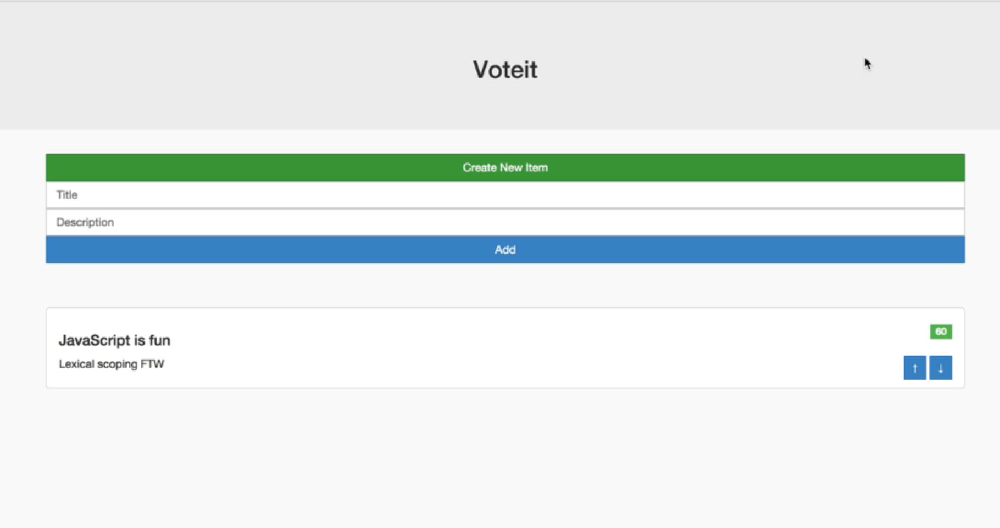

# README

1. `npm install`

2. `gulp` or `gulp serve`


## Thought Process

### Mockup Goal



### Structure Breakdown

```
<Feed>

  <ShowAddButton />
  <FeedForm />

  <FeedList>
    <FeedItem />
  </FeedList>

</Feed>
```
